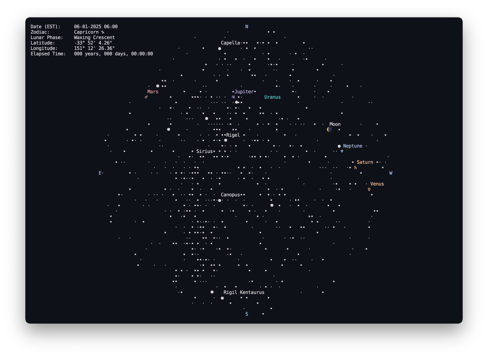

# 🌌 astroterm

[](https://github.com/da-luce/astroterm/actions?query=branch%3Amain)
[](https://codecov.io/gh/da-luce/astroterm)
[](https://github.com/da-luce/astroterm/releases)
[](https://opensource.org/licenses/MIT)

`astroterm` is a terminal-based star map written in `C`. It displays the real-time positions of stars, planets, constellations, and more, all within your terminal—no telescope required! Configure sky views by date, time, and location with precise ASCII-rendered visuals. See [usage](#usage) for all supported options!

`astroterm` is constantly improving, and we'd love to hear your ideas! If you have a suggestion or find a bug, please open an issue and share your feedback. See [`CONTRIBUTING.md`](./CONTRIBUTING.md) for guidelines on building, testing, and contributing to `astroterm`.


_<p align="center">The night sky above Singapore on January 2, 2025<br>See <a href="#example-1">usage</a> on how to obtain this view</p>_

<!-- omit in toc -->
## Table of Contents

- [🌌 astroterm](#-astroterm)
  - [Features](#features)
  - [Installation](#installation)
  - [Usage](#usage)
  - [Troubleshooting](#troubleshooting)
  - [Citations](#citations)
  - [Data Sources](#data-sources)

## Features

- 🔭 **Highly Customizable:** Choose any date, time, and location to explore past, present, or future celestial events
- 📐 **Accurate Rendering:** View the moon, stars, and planets with as much precision as terminal graphics allow
- 🌘 **Moon Phases:** Precise lunar phases in real-time
- 🌌 **Constellation Figures:** Detailed constellation shapes
- ⚡ **Performance Optimized:** Lightweight and fast ASCII rendering



_<p align="center">Stars over Sydney, Australia on January 6, 2025</p>_

## Installation

Several installation methods are provided based on your platform. If none of these fit your needs, you can always [build from source](#building-from-source). Refer to [troubleshooting](#troubleshooting) for help resolving any issues.

[](https://repology.org/project/astroterm/versions)

### Arch Linux

You can install `astroterm` from the [extra repository](https://archlinux.org/packages/extra/x86_64/astroterm/) using [pacman](https://wiki.archlinux.org/title/Pacman):

```sh
pacman -S astroterm
```

### Fedora

You can install `astroterm` directly from the [Fedora package repository](https://packages.fedoraproject.org/pkgs/astroterm/astroterm) on Fedora 40+.

```sh
sudo dnf install astroterm
```

### Homebrew

You can install `astroterm` from [Homebrew](https://formulae.brew.sh/formula/astroterm) via:

```sh
brew install astroterm
```

### Nix

You can try the [package](https://search.nixos.org/packages?channel=unstable&from=0&size=50&sort=relevance&type=packages&query=astroterm) in a temporary environment with the following command:

```sh
nix-shell -I nixpkgs=channel:nixpkgs-unstable -p astroterm --command astroterm
```

Argument flags are added by wrapping the command in quotes. For example:

```sh
nix-shell -I nixpkgs=channel:nixpkgs-unstable -p astroterm --command "astroterm -u -c"
```

To make `astroterm` available from your `$PATH`, install it with:

```sh
nix-env -f channel:nixpkgs-unstable -iA astroterm
```

### Guix

You can install `astroterm` directly from the [Guix main
channel](https://hpc.guix.info/package/astroterm) starting from
[this commit](https://data.guix.gnu.org/revision/4b5f0408e66392ab745dc0f7830732217d88f17d).

```sh
guix time-machine --commit=4b5f0408e66392ab745dc0f7830732217d88f17d -- shell astroterm
```

Or after `guix pull`:

```sh
guix shell astroterm -- astroterm --help  # to try
guix package --install astroterm          # add to current profile
```

### Prebuilt Executable

#### Unix

1. Download the latest executable using `wget`

    ```sh
    wget -O astroterm "https://github.com/da-luce/astroterm/releases/latest/download/astroterm-<os>-<arch>"
    ```

   - Replace `<os>` with the appropriate platform:
     - **Linux:** `linux`
     - **macOS:** `darwin`
   - Replace `<arch>` with the appropriate architecture:
     - **Linux:** `x86_64` (arm64 support to come after [Ubuntu arm64 runners](https://github.blog/news-insights/product-news/arm64-on-github-actions-powering-faster-more-efficient-build-systems/) are available)
     - **Apple Silicon (M-series):** `aarch64`
     - **Intel-based Macs:** `x86_64`
   - To view all supported combinations, see the [Releases](https://github.com/da-luce/astroterm/releases) page.

2. Run the executable

    ```sh
    chmod +x ./astroterm
    ./astroterm
    ```

#### Windows

1. Download the latest `.exe` file using PowerShell's `Invoke-WebRequest`:

    ```powershell
    Invoke-WebRequest -Uri "https://github.com/da-luce/astroterm/releases/latest/download/astroterm-win-x86_64.exe" -OutFile "astroterm.exe"
    ```

2. Run the `.exe`

    ```powershell
    .\astroterm.exe
    ```

### [Building From Source](./CONTRIBUTING.md#building-from-source)

## Usage

<!-- omit in toc -->
### Options

The `--help` flag displays all supported options:

```text
Usage: astroterm [OPTION]...

  -a, --latitude=<degrees>  Observer latitude [-90°, 90°] (default: 0.0)
  -o, --longitude=<degrees> Observer longitude [-180°, 180°] (default: 0.0)
  -d, --datetime=<yyyy-mm-ddThh:mm:ss>
                            Observation datetime in UTC
  -t, --threshold=<float>   Only render stars brighter than this magnitude
                            (default: 5.0)
  -l, --label-thresh=<float>
                            Label stars brighter than this magnitude (default:
                            0.25)
  -f, --fps=<int>           Frames per second (default: 24)
  -s, --speed=<float>       Animation speed multiplier (default: 1.0)
  -c, --color               Enable terminal colors
  -C, --constellations      Draw constellation stick figures. Note: a
                            constellation is only drawn if all stars in the
                            figure are over the threshold
  -g, --grid                Draw an azimuthal grid
  -u, --unicode             Use unicode characters
  -q, --quit-on-any         Quit on any keypress (default is to quit on 'q' or
                            'ESC' only)
  -m, --metadata            Display metadata
  -r, --aspect-ratio=<float>
                            Override the calculated terminal cell aspect ratio.
                            Use this if your projection is not 'square.' A value
                            around 2.0 works well for most cases
  -h, --help                Print this help message
  -i, --city=<city_name>    Use the latitude and longitude of the provided city.
                            If the name contains multiple words, enclose the
                            name in single or double quotes. For a list of
                            available cities, see:
                            https://github.com/da-luce/astroterm/blob/main/data/
                            cities.csv
  -v, --version             Display version info and exit
```

<!-- omit in toc -->
### Example 1

To achieve the "spinning globe" effect as shown in the [README GIF](./assets/SG_2025-01-02.gif), use the following flags:

```sh
astroterm --color --constellations --speed 10000 --fps 64 --city Singapore
```

or

```sh
astroterm -cC -s 10000 -f 64 -i Singapore
```

for short. In fact, any [city](./data/cities.csv) around the equator will work. Locations closer to the poles will look different because the apparent motion of the stars is more circular around the celestial pole rather than sweeping across the sky.

<!-- omit in toc -->
### Example 2

Say we wanted to view the sky at 5:00 AM (Eastern) on July 16, 1969—the morning
of the Apollo 11 launch at the Kennedy Space Center in Florida. We would run:

```sh
astroterm --latitude 28.573469 --longitude -80.651070 --datetime 1969-7-16T8:00:00
```

Finding the precise coordinates can be cumbersome, so we could also use the nearest major city to achieve a similar result:

```sh
astroterm --city Orlando --datetime 1969-7-16T8:00:00 -m
```

While we're still waiting for someone to invent time travel, we can cheat a little by using [Stellarium](https://stellarium-web.org/skysource/UpsPeg?fov=185.00&date=1969-07-19T09:00:00Z&lat=28.47&lng=-80.56&elev=0) to confirm that this aligns with reality.

If we then wanted to display constellations and add color, we would add `--constellations --color` as options.

If you simply want the current time, don't specify the `--datetime` option and
`astroterm` will use the system time. For your current location, you will still
have to specify the `--lat` and `--long` options, or provide the nearest city with the `--city` option.

For more options and help, run `astroterm -h` or `astroterm --help`.

> [!TIP]
> Use a tool like [LatLong](https://www.latlong.net/) to get your latitude and longitude.

> [!TIP]
> Star magnitudes decrease as apparent brightness increases, i.e., to show more stars, increase the threshold.

## Troubleshooting

<!-- omit in toc -->
### Release Won't Download via Curl

For some reason, `curl` does not follow the latest release redirect. Use `wget`
to download the latest release or hardcode the tag in the link using `curl`. Or,
just download via the [releases page](https://github.com/da-luce/astroterm/releases).

<!-- omit in toc -->
### Broken Unicode on Linux

If Unicode characters do not display correctly in the terminal, you may need to configure your system's locale to support Unicode.

1. Temporarily set the locale (add this to `.bashrc` or equivalent to permanently enforce)

  ```bash
  export LC_ALL="en_US.UTF-8"
  export LC_CTYPE="en_US.UTF-8"
  ```

2. Install and configure locales (example for Ubuntu/Debian)

  ```bash
  sudo apt update
  sudo apt install -y locales
  sudo dpkg-reconfigure locales
  ```

  During configuration, select `en_US.UTF-8` as the default locale.

## Citations

Many thanks to the following resources, which were invaluable to the development of this project.

- [Map Projections-A Working Manual by John P. Snyder](https://pubs.usgs.gov/pp/1395/report.pdf)
- [Wikipedia](https://en.wikipedia.org)
- [Atractor](https://www.atractor.pt/index-_en.html)
- [Jon Voisey's Blog: Following Kepler](https://jonvoisey.net/blog/)
- [Celestial Programming: Greg Miller's Astronomy Programming Page](https://astrogreg.com/convert_ra_dec_to_alt_az.html)
- [Practical Astronomy with your Calculator by Peter Duffett-Smith](https://www.amazon.com/Practical-Astronomy-Calculator-Peter-Duffett-Smith/dp/0521356997)
- [NASA Jet Propulsion Laboratory](https://ssd.jpl.nasa.gov/planets/approx_pos.html)
- [Paul Schlyter's "How to compute planetary positions"](https://stjarnhimlen.se/comp/ppcomp.html)
- [Dan Smith's "Meeus Solar Position Calculations"](https://observablehq.com/@danleesmith/meeus-solar-position-calculations)
- [Bryan Weber's "Orbital Mechanics Notes"](https://github.com/bryanwweber/orbital-mechanics-notes)
- [ASCOM](https://ascom-standards.org/Help/Developer/html/72A95B28-BBE2-4C7D-BC03-2D6AB324B6F7.htm)
- [A Fast Bresenham Type Algorithm For Drawing Ellipses](https://dai.fmph.uniba.sk/upload/0/01/Ellipse.pdf)

## Data Sources

- Stars: [Yale Bright Star Catalog](http://tdc-www.harvard.edu/catalogs/bsc5.html)
- Star names: [IAU Star Names](https://www.iau.org/public/themes/naming_stars/)
- Constellation figures: [Stellarium](https://github.com/Stellarium/stellarium/blob/3c8d3c448f82848e9d8c1af307ec4cad20f2a9c0/skycultures/modern/constellationship.fab#L6) (Converted from [Hipparchus](https://heasarc.gsfc.nasa.gov/w3browse/all/hipparcos.html) to [BSC5](http://tdc-www.harvard.edu/catalogs/bsc5.html) indices using the [HYG Database](https://www.astronexus.com/projects/hyg)—see [convert_constellations.py](./scripts/convert_constellations.py))
- Cities: [GeoNames](https://download.geonames.org/) (Filtered and condensed using [filter_cities.py](./scripts/filter_cities.py))
- Planet orbital elements: [NASA Jet Propulsion Laboratory](https://ssd.jpl.nasa.gov/planets/approx_pos.html)
- Planet magnitudes: [Computing Apparent Planetary Magnitudes for The Astronomical Almanac](https://arxiv.org/abs/1808.01973)
